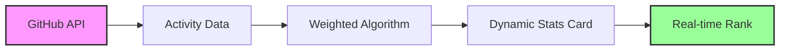
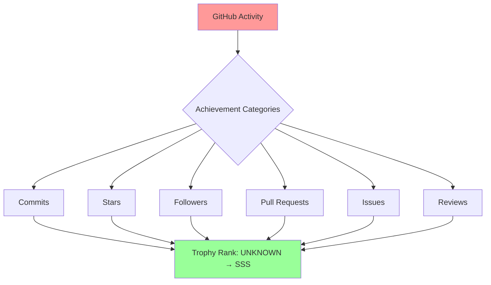
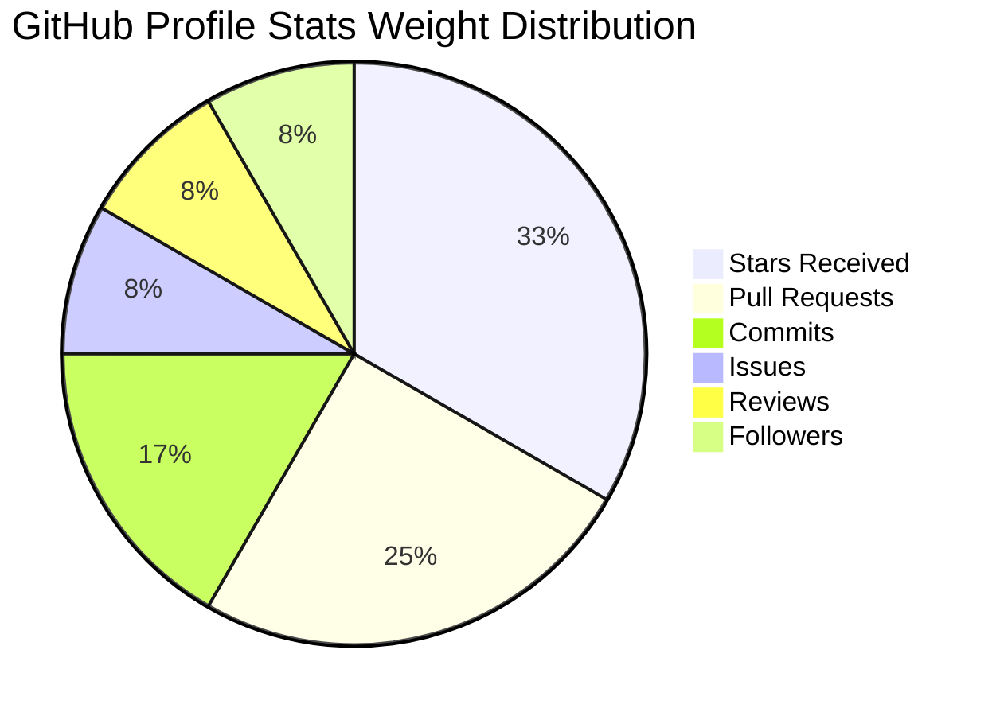
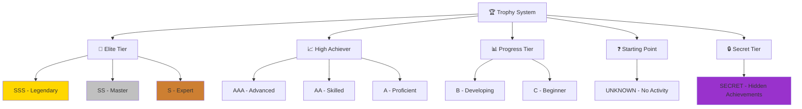
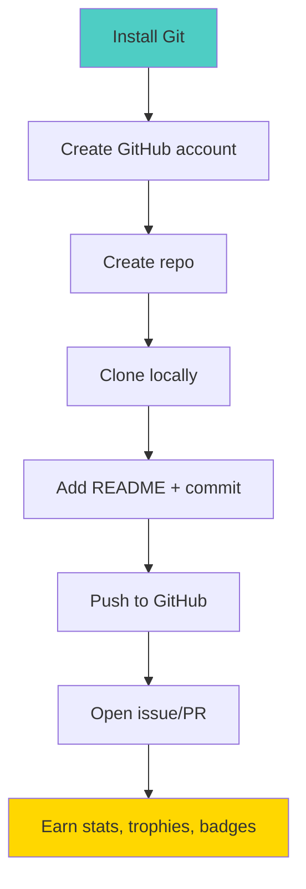
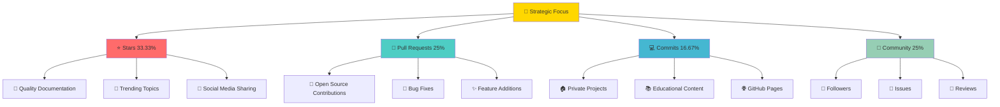
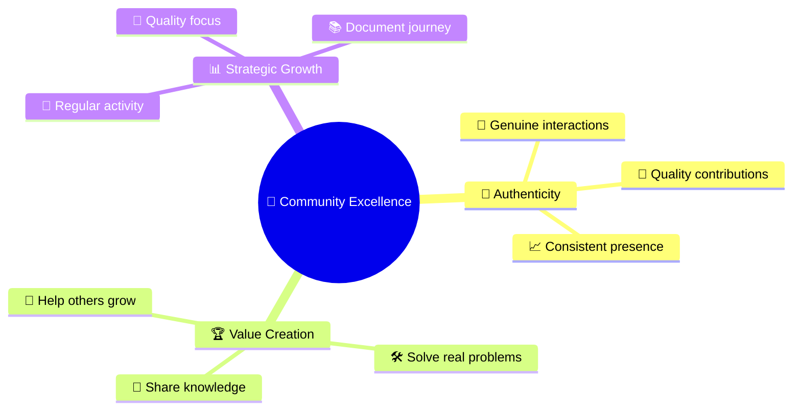
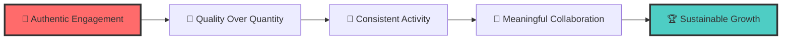
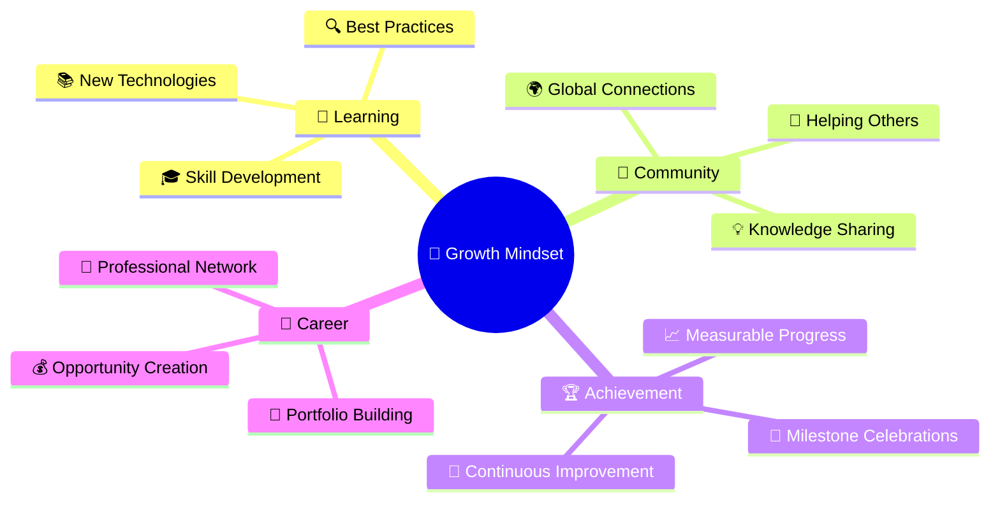

# 🚀 GitHub Profile Enhancement Guide
## Master the Two Most Popular Ranking Systems

<div align="center">


[](https://github.com)
[](https://github.com)
[](https://github.com)

</div>

---

## 🎯 Introduction

> **Transform your GitHub presence from ordinary to extraordinary!**

GitHub profiles have evolved beyond simple repositories into powerful showcases of developer expertise. Two dominant ranking systems shape how the community recognizes talent and tracks progress:

<div align="center">

| 📊 **GitHub Profile Stats** | 🏆 **GitHub Profile Trophies** |
|:---------------------------:|:------------------------------:|
| Dynamic performance analytics | Gamified achievement system |
| Real-time rank calculation | Visual trophy collection |
| Comprehensive activity tracking | Hierarchical progression rewards |

</div>

This comprehensive guide will transform your GitHub profile into a compelling showcase that accurately reflects your contributions and achievements.

---

## 🔍 Understanding the Two Ranking Systems

### 📊 GitHub Profile Stats
<div align="left">



</div>

**GitHub Profile Stats** is a dynamic web service that generates personalized statistics cards showing your overall GitHub performance through comprehensive rank calculations based on multi-dimensional participation metrics.

### 🏆 GitHub Profile Trophies
<div align="left">



</div>

**GitHub Profile Trophies** gamifies your GitHub journey with a hierarchical ranking system from `UNKNOWN` to `SSS` rank, awarding virtual trophies for various achievements across different aspects of your activity.

---

## 📊 GitHub Profile Stats: Deep Dive

<div align="center">

### ⚖️ Ranking Algorithm Breakdown

</div>

<div align="center">



</div>

| 🎯 **Activity** | ⚖️ **Weight** | 📈 **Impact Level** | 💡 **Strategy Focus** |
|:----------------|:--------------|:-------------------|:----------------------|
| ⭐ **Stars Received** | `33.33%` | 🔥 **HIGHEST** | Quality repositories & documentation |
| 🔄 **Pull Requests** | `25.00%` | 🚀 **HIGH** | Open-source contributions |
| 💻 **Commits** | `16.67%` | 📊 **MODERATE** | Consistent coding activity |
| 🐛 **Issues** | `8.33%` | 📝 **LOWER** | Community engagement |
| 👀 **Reviews** | `8.33%` | 🔍 **LOWER** | Code review participation |
| 👥 **Followers** | `8.33%` | 🌟 **LOWER** | Community recognition |

---

### 🛠️ Setting Up GitHub Profile Stats

<details>
<summary>📋 <strong>Step-by-Step Setup Guide</strong></summary>

#### **Step 1: Create Your Profile Repository**
Create a repository with the same name as your GitHub username:
```
your-username/your-username
```

#### **Step 2: Add the Stats Card**
```html
<div align="center">
  
</div>
```

</details>

---

### 🎨 Advanced Configuration Options

<div align="center">

| 🌈 **Theme** | 🔧 **Configuration** | 🎯 **Purpose** |
|:-------------|:---------------------|:---------------|
| `&count_private=true` | Include private repos | Boost commit count |
| `&include_all_commits=true` | All commits counted | Complete activity picture |
| `&theme=tokyonight` | Visual aesthetics | Professional appearance |
| `&show_icons=true` | Visual icons | Enhanced readability |
| `&hide_border=true` | Clean borders | Modern look |

</div>

#### 🎨 Popular Theme Showcase

<div align="center">

```
🌙 dark        🔥 radical      🌲 merko        📊 gruvbox
🌃 tokyonight  🌑 onedark      ⚡ cobalt       🌊 synthwave
🎭 dracula     🌈 highcontrast  and many more...
```

</div>

---

## 🏆 GitHub Profile Trophies: Complete Guide

<div align="center">

### 🎖️ Trophy Ranking Hierarchy

</div>

<div align="center">



</div>

| 🎖️ **Rank Level** | 📝 **Description** | ✨ **Achievement Status** | 🎯 **Bragging Rights** |
|:------------------|:-------------------|:--------------------------|:------------------------|
| 🌟 **SSS, SS, S** | Elite tier achievements | Ultra-rare accomplishments | 🏆 **Legendary Status** |
| 📈 **AAA, AA, A** | High achiever tier | Consistent effort results | 🚀 **Impressive Level** |
| 📊 **B, C** | Progress tier | Good momentum building | 📈 **On the Right Track** |
| ❓ **UNKNOWN (?)** | No activity detected | Time to start your journey | 🌱 **Ready to Begin** |
| 🔒 **SECRET** | Hidden achievements | Very rare, undisclosed conditions | 🎭 **Mystery Master** |

---

## 🏆 Detailed Trophy Requirements & Strategy

<div align="center">

### 💻 Commits Trophy
*Tracks your total commit count across all repositories*

</div>

<div align="center">

| 🎖️ **Rank** | 🏷️ **Title** | 📊 **Required** | 🎯 **Strategy** |
|:------------|:--------------|:----------------|:----------------|
| 🌟 **SSS** | God Committer | `4,000+ commits` | 🔥 Daily coding habits |
| ⭐ **SS** | Deep Committer | `2,000+ commits` | 📈 Consistent long-term work |
| 🏅 **S** | Super Committer | `1,000+ commits` | 💪 Serious dedication |
| 🥇 **AAA** | Ultra Committer | `500+ commits` | 🎯 Focused development |
| 🥈 **AA** | Hyper Committer | `200+ commits` | 📊 Regular contributor |
| 🥉 **A** | High Committer | `100+ commits` | 🌱 Growing developer |
| 📈 **B** | Middle Committer | `10+ commits` | 🚀 Getting started |
| 🌱 **C** | First Commit | `1+ commits` | ✨ Welcome to GitHub! |

</div>

---

<div align="center">

### ⭐ Stars Trophy
*Based on total stars received across all repositories*

</div>

<div align="center">

| 🎖️ **Rank** | 🏷️ **Title** | ⭐ **Required** | 💡 **Pro Tips** |
|:------------|:--------------|:----------------|:-----------------|
| 🌟 **SSS** | Super Stargazer | `2,000+ stars` | 🚀 Viral project creation |
| ⭐ **SS** | High Stargazer | `700+ stars` | 📊 Multiple successful repos |
| 🏅 **S** | Stargazer | `200+ stars` | 💎 Quality over quantity |
| 🥇 **AAA** | Super Star | `100+ stars` | 📝 Great documentation |
| 🥈 **AA** | High Star | `50+ stars` | 🎯 Useful tools/libraries |
| 🥉 **A** | You are a Star | `30+ stars` | 🌟 Growing recognition |
| 📈 **B** | Middle Star | `10+ stars` | 📊 Building momentum |
| 🌱 **C** | First Star | `1+ stars` | ⭐ First appreciation! |

</div>

---

<div align="center">

### 👥 Followers Trophy
*Counts your total GitHub followers*

</div>

<div align="center">

| 🎖️ **Rank** | 🏷️ **Title** | 👥 **Required** | 🌟 **Community Building** |
|:------------|:--------------|:----------------|:---------------------------|
| 🌟 **SSS** | Super Celebrity | `1,000+ followers` | 🎭 GitHub influencer status |
| ⭐ **SS** | Ultra Celebrity | `400+ followers` | 📢 Strong community presence |
| 🏅 **S** | Hyper Celebrity | `200+ followers` | 🌐 Well-known contributor |
| 🥇 **AAA** | Famous User | `100+ followers` | 💫 Recognized expertise |
| 🥈 **AA** | Active User | `50+ followers` | 🤝 Growing network |
| 🥉 **A** | Dynamic User | `20+ followers` | 📈 Engaging with community |
| 📈 **B** | Many Friends | `10+ followers` | 👋 Making connections |
| 🌱 **C** | First Friend | `1+ followers` | 🎉 Someone noticed you! |

</div>

---

<div align="center">

### 🔄 Pull Requests Trophy
*Based on total pull requests created*

</div>

<div align="center">

| 🎖️ **Rank** | 🏷️ **Title** | 🔄 **Required** | 🚀 **Contribution Strategy** |
|:------------|:--------------|:----------------|:------------------------------|
| 🌟 **SSS** | God Puller | `1,000+ PRs` | 🏆 Open-source champion |
| ⭐ **SS** | Deep Puller | `500+ PRs` | 🌊 Consistent contributor |
| 🏅 **S** | Super Puller | `200+ PRs` | 💪 Serious collaborator |
| 🥇 **AAA** | Ultra Puller | `100+ PRs` | 🎯 Regular contributor |
| 🥈 **AA** | Hyper Puller | `50+ PRs` | 📊 Active participant |
| 🥉 **A** | High Puller | `20+ PRs` | 🌱 Growing contributor |
| 📈 **B** | Middle Puller | `10+ PRs` | 🚀 Getting involved |
| 🌱 **C** | First Pull | `1+ PRs` | ✨ First contribution! |

</div>

---

<div align="center">

### 🐛 Issues Trophy
*Tracks total issues created across repositories*

</div>

<div align="center">

| 🎖️ **Rank** | 🏷️ **Title** | 🐛 **Required** | 📝 **Quality Focus** |
|:------------|:--------------|:----------------|:---------------------|
| 🌟 **SSS** | God Issuer | `1,000+ issues` | 🔍 Master bug hunter |
| ⭐ **SS** | Deep Issuer | `500+ issues` | 📊 Systematic reporter |
| 🏅 **S** | Super Issuer | `200+ issues` | 💎 Quality feedback |
| 🥇 **AAA** | Ultra Issuer | `100+ issues` | 🎯 Helpful suggestions |
| 🥈 **AA** | Hyper Issuer | `50+ issues` | 📈 Active reporter |
| 🥉 **A** | High Issuer | `20+ issues` | 🌱 Contributing feedback |
| 📈 **B** | Middle Issuer | `10+ issues` | 🚀 Getting started |
| 🌱 **C** | First Issue | `1+ issues` | ✨ First report! |

</div>

---

<div align="center">

### 📚 Repositories Trophy
*Based on total public repositories created*

</div>

<div align="center">

| 🎖️ **Rank** | 🏷️ **Title** | 📚 **Required** | 🎨 **Creative Strategy** |
|:------------|:--------------|:----------------|:-------------------------|
| 🌟 **SSS** | God Repo Creator | `100+ repositories` | 🏆 Prolific creator |
| ⭐ **SS** | Deep Repo Creator | `90+ repositories` | 🌊 Consistent builder |
| 🏅 **S** | Super Repo Creator | `80+ repositories` | 💪 Serious developer |
| 🥇 **AAA** | Ultra Repo Creator | `50+ repositories` | 🎯 Multi-project focus |
| 🥈 **AA** | Hyper Repo Creator | `30+ repositories` | 📊 Active creator |
| 🥉 **A** | High Repo Creator | `20+ repositories` | 🌱 Building portfolio |
| 📈 **B** | Middle Repo Creator | `10+ repositories` | 🚀 Getting creative |
| 🌱 **C** | First Repository | `1+ repositories` | ✨ First project! |

</div>

---

<div align="center">

### 👀 Reviews Trophy
*Counts total code reviews completed*

</div>

<div align="center">

| 🎖️ **Rank** | 🏷️ **Title** | 👀 **Required** | 🔍 **Review Excellence** |
|:------------|:--------------|:----------------|:-------------------------|
| 🌟 **SSS** | God Reviewer | `70+ reviews` | 🏆 Code quality guardian |
| ⭐ **SS** | Deep Reviewer | `57+ reviews` | 🌊 Thorough examiner |
| 🏅 **S** | Super Reviewer | `45+ reviews` | 💪 Detail-oriented |
| 🥇 **AAA** | Ultra Reviewer | `30+ reviews` | 🎯 Quality focused |
| 🥈 **AA** | Hyper Reviewer | `20+ reviews` | 📊 Active reviewer |
| 🥉 **A** | Active Reviewer | `8+ reviews` | 🌱 Contributing wisdom |
| 📈 **B** | Intermediate Reviewer | `3+ reviews` | 🚀 Learning to review |
| 🌱 **C** | New Reviewer | `1+ reviews` | ✨ First review! |

</div>

---

<div align="center">

### ⏰ Experience Trophy
*Based on account age (time-based achievement)*

</div>

<div align="center">

| 🎖️ **Rank** | 🏷️ **Title** | ⏰ **Account Age** | 🎓 **Wisdom Level** |
|:------------|:--------------|:-------------------|:--------------------|
| 🌟 **SSS** | Seasoned Veteran | `~20+ years` | 🧙‍♂️ Ancient wisdom |
| ⭐ **SS** | Grandmaster | `~15+ years` | 👴 Old-school expert |
| 🏅 **S** | Master Dev | `~10+ years` | 🎓 Decade of experience |
| 🥇 **AAA** | Expert Dev | `~7.5+ years` | 💡 Senior developer |
| 🥈 **AA** | Experienced Dev | `~5+ years` | 📊 Mid-level expertise |
| 🥉 **A** | Intermediate Dev | `~3+ years` | 🌱 Growing experience |
| 📈 **B** | Junior Dev | `~1.5+ years` | 🚀 Building skills |
| 🌱 **C** | Newbie | `~0.5+ years` | ✨ Fresh start! |

</div>

---

## 🎭 Secret Trophies: Hidden Achievements

<div align="center">

### 🔒 Unlock the Mysteries

</div>

<div align="center">

| 🏆 **Trophy** | 🎭 **Title** | 🔓 **Requirement** | 🌟 **Rarity** |
|:--------------|:----------------|:-------------------|:---------------|
| 🌈 **MultiLanguage** | Rainbow Lang User | `10+ languages` | 🎨 Polyglot programmer |
| ⭐ **AllSuperRank** | S Rank Hacker | `All trophies S+` | 🏆 Ultimate achievement |
| 🏢 **Organizations** | Jack of all Trades | `3+ organizations` | 🤝 Team player |
| ⏳ **LongTimeUser** | Village Elder | `10+ years` | 👴 Time-tested veteran |
| 🎉 **Joined2020** | Everything started... | `Joined in 2020` | 📅 Pandemic coder |
| 🏛️ **AncientUser** | Ancient User | `Joined before 2010` | 🏺 GitHub archaeology |
| 👑 **OGUser** | OG User | `Joined in 2008` | 👑 Original GitHub royalty |

</div>

---

### 🛠️ Setting Up GitHub Profile Trophies

<details>
<summary>⚙️ <strong>Implementation Guide</strong></summary>

#### **Basic Implementation:**
```markdown
<div align="center">
  
</div>
```

#### **Advanced Configuration:**
```markdown
<div align="center">
  
</div>
```

</details>

---

### 🎨 Customization Showcase

<div align="center">

| 🎨 **Option** | ⚙️ **Parameter** | 🎯 **Effect** |
|:--------------|:-----------------|:--------------|
| 🌈 **Themes** | `theme=onedark` | Visual aesthetics |
| 📐 **Layout** | `column=6` | Trophy arrangement |
| 🎯 **Filtering** | `rank=S,AAA` | Show specific ranks |
| 🖼️ **Visual** | `no-bg=true` | Transparent background |

</div>

---

## 🏅 GitHub Achievements: Native Badges

<div align="center">

### 🎖️ Badge Overview

</div>

| 🏅 **Badge** | ✅ **How to Earn** | 🧭 **Status/Notes** |
|:-------------|:-------------------|:--------------------|
| 🧊 **Arctic Code Vault Contributor** | Contribute code to repositories preserved in the GitHub Archive Program's Arctic Code Vault | Historical badge; no longer earnable |
| 🧠 **Galaxy Brain** | Have an answer marked as **Accepted** in a GitHub Discussions thread | Earnable where Discussions are enabled |
| ❤️ **Heart On Your Sleeve** | React to content on GitHub with a ❤️ | In limited testing/unreleased; may not appear for all users |
| 🚁 **Mars 2020 Contributor** | Contribute to the Mars 2020 Helicopter Mission repository | Historical badge; no longer earnable |
| 🧙 **Open Sourcerer** | Unannounced by GitHub | Criteria unconfirmed/unreleased |
| 🤝 **Pair Extraordinaire** | Co-author commits in a pull request that gets merged | Use `Co-authored-by:` trailers; badge is active |
| 💜 **Public Sponsor** | Actively sponsor at least one account/org via GitHub Sponsors | Badge displays while sponsorship is active |
| 🦈 **Pull Shark** | Have pull requests merged | GitHub has not published the exact threshold; keep merging PRs |
| ⚡ **Quickdraw** | Close an issue or pull request within 5 minutes of opening it | Time-based trigger on self-opened items |
| ⭐ **Starstruck** | Create a repository that receives a certain number of stars | Threshold not published; build and share a popular repo |
| 🎲 **YOLO** | Merge a pull request without an approved review | Not recommended for production, but badge awards automatically |

> 🔒 Achievements are automatic—no manual toggles. GitHub does not publish exact numeric thresholds for Pull Shark or Starstruck, so focus on steady contributions and quality projects.

<div align="center">

### 🔎 Where to See Them

</div>

1. Open your GitHub profile → **Achievements** panel.  
2. Hover to see criteria; click **Hide** on a badge if you prefer privacy.  
3. Badges sync automatically across profile, orgs, and sponsors page.

<div align="center">

### ⚡ Quick Actions to Target Badges

</div>

| 🎯 **Action** | 🏅 **Badges Impacted** | 💡 **Tip** |
|:-------------|:-----------------------|:------------|
| Merge quality PRs regularly | Pull Shark, Pair Extraordinaire | Add `Co-authored-by:` lines when pairing |
| Answer GitHub Discussions | Galaxy Brain | Prefer concise, reproducible solutions |
| Sponsor maintainers | Public Sponsor | Small monthly tiers still count |
| Launch and promote a useful repo | Starstruck | Add docs, screenshots, and a demo link |
| Keep issue/PR hygiene tight | Quickdraw | Close duplicates fast (explain why) |

---

## 🧭 New to GitHub? Quickstart Tutorial

<div align="center">



</div>

<details>
<summary>📋 <strong>Step-by-Step</strong></summary>

1. **Install Git + sign in**: Install Git, then run:
  ```bash
  git config --global user.name "Your Name"
  git config --global user.email "you@example.com"
  ```
2. **Create a repository on GitHub**: New repo → name it; add a license if you know which one you need.
3. **Clone locally**:
  ```bash
  git clone https://github.com/your-username/your-repo.git
  cd your-repo
  ```
4. **Add a README** (and any starter files):
  ```bash
  echo "# My First Project" > README.md
  git add README.md
  git commit -m "chore: add README"
  git push origin main
  ```
5. **Open an issue for work you plan to do**: Write what/why; this builds history.
6. **Create a branch and a pull request**:
  ```bash
  git checkout -b feature/hello
  echo "print('hello')" > hello.py
  git add hello.py
  git commit -m "feat: add hello script"
  git push origin feature/hello
  ```
  Then open a PR on GitHub, link the issue, and request review.
7. **Respond and merge**: Address review comments, then merge. Delete the branch to keep things tidy.
8. **Watch achievements grow**: Merged PRs feed Pull Shark, co-authored commits feed Pair Extraordinaire, discussions answers feed Galaxy Brain, etc.

</details>

<div align="center">

### 🧰 Beginner-Friendly Checklist

</div>

| ✅ **Do This** | 🎯 **Why It Matters** |
|:---------------|:----------------------|
| Keep a living README in your profile repo (`your-username/your-username`) | Shows stats/trophies on your profile page |
| Use small, frequent commits with clear messages | Easier reviews; faster Pull Shark progress |
| Start with docs/issues before code | Low-friction way to contribute and learn a codebase |
| Answer one Discussions question per week | Targets Galaxy Brain and builds reputation |
| Sponsor a maintainer you rely on | Unlocks Public Sponsor and supports the ecosystem |

---

## 🚀 Strategic Improvement Guide

<div align="center">

### 📈 Boost Your GitHub Profile Stats Rank

</div>



---

### 🎯 Trophy Earning Strategies

<div align="center">

#### 🏃‍♂️ Quick Wins (Start Here!)
| 🎯 **Target** | 📊 **Effort** | ⏰ **Timeline** |
|:-------------|:---------------|:----------------|
| 📚 **Repositories (C-B)** | `1-10 repos` | 🕐 1-2 weeks |
| 💻 **Commits (C-B)** | `1-10 commits` | 🕐 Few days |
| 🐛 **Issues (C)** | `1 issue` | 🕐 1 day |
| 👀 **Reviews (C)** | `1 review` | 🕐 1 day |

#### 📈 Medium-term Goals (Build Momentum)
| 🎯 **Target** | 📊 **Effort** | ⏰ **Timeline** |
|:-------------|:---------------|:----------------|
| ⭐ **Stars (A-AA)** | `30-50 stars` | 🕑 2-6 months |
| 👥 **Followers (A-AA)** | `20-50 followers` | 🕑 3-6 months |
| 🔄 **Pull Requests (A-AA)** | `20-50 PRs` | 🕑 3-6 months |

#### 🏆 Long-term Achievements (Dedication Required)
| 🎯 **Target** | 📊 **Effort** | ⏰ **Timeline** |
|:-------------|:---------------|:----------------|
| 💻 **Commits (S+)** | `1,000+ commits` | 🕒 1-2 years |
| ⭐ **Stars (S+)** | `200+ stars` | 🕒 1-3 years |
| ⏰ **Experience (AAA+)** | `7.5+ years` | 🕓 Time-based |

#### 👑 Elite Tier (For Legends)
| 🎯 **Target** | 📊 **Effort** | ⏰ **Timeline** |
|:-------------|:---------------|:----------------|
| 🌟 **Any SSS rank** | `Exceptional dedication` | 🕕 2-5 years |
| 🔒 **Secret trophies** | `Diverse activities` | 🕕 Ongoing |

</div>

---

## 💡 Best Practices for Both Systems

<div align="center">

### 🎨 Content Strategy Diversification

</div>

GitHub isn't just for code! Expand your impact with diverse content:

<div align="center">

| 📝 **Content Type** | 🎯 **Examples** | 💰 **Stats Impact** |
|:--------------------|:----------------|:---------------------|
| 📚 **Documentation** | Tutorials, guides, best practices | ⭐ High stars potential |
| 🎓 **Educational** | Course materials, learning resources | 👥 Follower growth |
| 🎨 **Creative Works** | Design assets, writing, compositions | 💻 Commit diversity |
| 🔬 **Research** | Academic papers, data analysis | 🔄 Collaboration opportunities |
| 🛠️ **Personal Tools** | Automation scripts, productivity tools | ⭐ Practical value |

</div>

---

### 🤝 Community Engagement Excellence

<div align="center">



</div>

---

## 🎪 Complete Implementation Showcase

<div align="center">

### 🌟 Your Ultimate GitHub Profile Setup

</div>

```markdown
<div align="center">

# 👋 Hi there, I'm [Your Name]!


[](https://git.io/typing-svg)

</div>

---

## 📊 GitHub Statistics

<div align="center">


</div>

---

## 🏆 GitHub Trophies

<div align="center">


</div>

---

## 📈 Contribution Graph

<div align="center">


</div>

---

## 🛠️ Tech Stack

<div align="center">


</div>

---

<div align="center">

### 🌟 Let's Connect!

[](your-linkedin)
[](your-twitter)
[](your-portfolio)


</div>
```

---

## 🎯 Conclusion

<div align="center">


</div>

Both **GitHub Profile Stats** and **GitHub Profile Trophies** offer unique pathways to showcase your development journey. While Profile Stats provides comprehensive numerical rankings through weighted algorithms, Profile Trophies gamify achievements with visual rewards and progression systems.

## 🚀 Key Success Principles

<div align="center">



</div>

### ✨ The Golden Rules

| 🎯 **Principle** | 📝 **Implementation** | 🎉 **Result** |
|:-----------------|:-----------------------|:---------------|
| 🤝 **Authentic Engagement** | Genuine contributions to projects you care about | 🌟 Meaningful community connections |
| 💎 **Quality Focus** | Well-documented, useful repositories | ⭐ Higher star ratings and recognition |
| 🔄 **Consistency** | Regular activity over sporadic bursts | 📈 Steady rank improvements |
| 🤲 **Value Creation** | Solve real problems, help others | 👥 Natural follower growth |
| 📚 **Continuous Learning** | Document your journey and share knowledge | 🎓 Establish expertise and authority |

---

## 🎪 Advanced Profile Enhancement Tips

<div align="center">

### 🌈 Visual Storytelling Elements

</div>

<details>
<summary>🎨 <strong>Dynamic Visual Components</strong></summary>

#### **Animated Headers**
```markdown

```

#### **Typing Animation**
```markdown
[](https://git.io/typing-svg)
```

#### **Activity Snake Animation**
```markdown

```

#### **Visitor Counter**
```markdown

```

</details>

---

<div align="center">

### 🏅 Achievement Showcase Combinations

</div>

<div align="center">

| 🎯 **Profile Level** | 📊 **Stats Setup** | 🏆 **Trophy Config** | 🎨 **Visual Theme** |
|:---------------------|:-------------------|:---------------------|:---------------------|
| 🌱 **Beginner** | Basic stats + language stats | All ranks visible | Light, welcoming themes |
| 📈 **Intermediate** | Stats + streak + activity | Filter B+ ranks | Modern, professional themes |
| 🏆 **Advanced** | Full stats suite + custom widgets | S+ ranks only | Dark, sophisticated themes |
| 👑 **Expert** | Custom dashboard + metrics | SSS/Secret trophies focus | Unique, branded themes |

</div>

---

## 🌟 Motivation and Mindset

<div align="center">

### 💪 Remember Your Why

</div>

These ranking systems are **tools for growth**, not just vanity metrics. They should inspire you to:

<div align="center">



</div>

---

## 🎯 Action Plan: Your 30-60-90 Day Strategy

<div align="center">

### 📅 Structured Growth Plan

</div>

<div align="center">

| ⏰ **Timeline** | 🎯 **Focus Areas** | 📊 **Expected Outcomes** | ✅ **Action Items** |
|:----------------|:-------------------|:--------------------------|:--------------------|
| 🌱 **Days 1-30** | Profile Setup & Quick Wins | Basic trophies (C-B ranks) | • Set up both systems<br>• Create 5-10 repositories<br>• Make first contributions |
| 📈 **Days 31-60** | Content Creation & Community | Growing stats & A ranks | • Build quality projects<br>• Start contributing to OSS<br>• Engage with community |
| 🏆 **Days 61-90** | Optimization & Strategy | Higher ranks & recognition | • Refine profile aesthetics<br>• Focus on high-impact activities<br>• Build consistent habits |

</div>

---

## 🛠️ Tools and Resources

<div align="center">

### 🔧 Essential GitHub Profile Tools

</div>

<div align="center">

| 🛠️ **Tool** | 🎯 **Purpose** | 🔗 **Link** | ⭐ **Rating** |
|:------------|:---------------|:-------------|:--------------|
| 📊 **GitHub Readme Stats** | Dynamic statistics cards | `github-readme-stats.vercel.app` | ⭐⭐⭐⭐⭐ |
| 🏆 **GitHub Profile Trophy** | Achievement trophies | `github-profile-trophy.vercel.app` | ⭐⭐⭐⭐⭐ |
| 🎨 **Capsule Render** | Animated headers/footers | `capsule-render.vercel.app` | ⭐⭐⭐⭐ |
| ⌨️ **Typing SVG** | Animated typing text | `readme-typing-svg.herokuapp.com` | ⭐⭐⭐⭐ |
| 🐍 **Snake Game** | Contribution visualization | GitHub Actions workflow | ⭐⭐⭐⭐ |
| 👁️ **Profile Views Counter** | Visitor tracking | `komarev.com/ghpvc` | ⭐⭐⭐ |

</div>

---

## 🎉 Final Words of Inspiration

<div align="center">

> **"Your GitHub profile is your digital legacy. Make it count!"** 🌟

</div>

Remember that behind every impressive GitHub profile is a developer who decided to start, stay consistent, and share their journey with the world. Whether you're aiming for your first star ⭐ or your thousandth commit 💻, every contribution matters.

The beauty of these ranking systems lies not in the competition, but in the **motivation they provide** to become a better developer and community member. Use them as stepping stones to:

- 🚀 **Push your boundaries** and try new technologies
- 🤝 **Connect with like-minded developers** worldwide  
- 📚 **Document your learning journey** for others to follow
- 💡 **Solve real problems** that matter to you and others
- 🌟 **Inspire the next generation** of developers

---

<div align="center">

### 🚀 Ready to Transform Your GitHub Profile?

**Start implementing these strategies today and watch your GitHub presence evolve from ordinary to extraordinary!**

[](https://github.com)
[](https://github.com)
[](https://github.com)

---

*Happy coding, and may your GitHub profile shine brighter than ever! ✨*


</div>
