# 🚀 GitHub Profile Enhancement Guide
## Master the Two Most Popular Ranking Systems

<div align="center">


[](https://github.com)
[](https://github.com)
[](https://github.com)

</div>

---

## 🎯 Introduction

> **Transform your GitHub presence from ordinary to extraordinary!**

GitHub profiles have evolved beyond simple repositories into powerful showcases of developer expertise. Two dominant ranking systems shape how the community recognizes talent and tracks progress:

<div align="center">

| 📊 **GitHub Profile Stats** | 🏆 **GitHub Profile Trophies** |
|:---------------------------:|:------------------------------:|
| Dynamic performance analytics | Gamified achievement system |
| Real-time rank calculation | Visual trophy collection |
| Comprehensive activity tracking | Hierarchical progression rewards |

</div>

This comprehensive guide will transform your GitHub profile into a compelling showcase that accurately reflects your contributions and achievements.

---

## 🔍 Understanding the Two Ranking Systems

### 📊 GitHub Profile Stats
<div align="left">

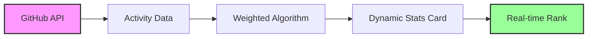

</div>

**GitHub Profile Stats** is a dynamic web service that generates personalized statistics cards showing your overall GitHub performance through comprehensive rank calculations based on multi-dimensional participation metrics.

### 🏆 GitHub Profile Trophies
<div align="left">

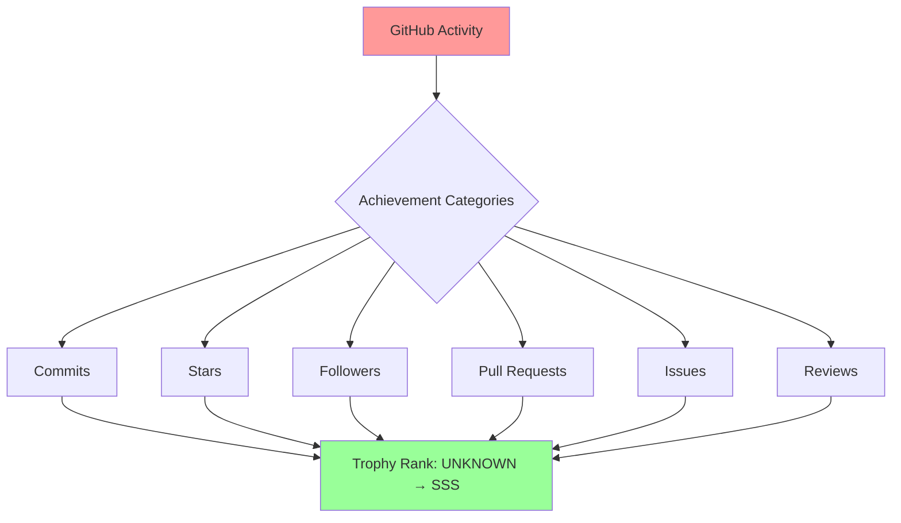

</div>

**GitHub Profile Trophies** gamifies your GitHub journey with a hierarchical ranking system from `UNKNOWN` to `SSS` rank, awarding virtual trophies for various achievements across different aspects of your activity.

---

## 📊 GitHub Profile Stats: Deep Dive

<div align="center">

### ⚖️ Ranking Algorithm Breakdown

</div>

<div align="center">

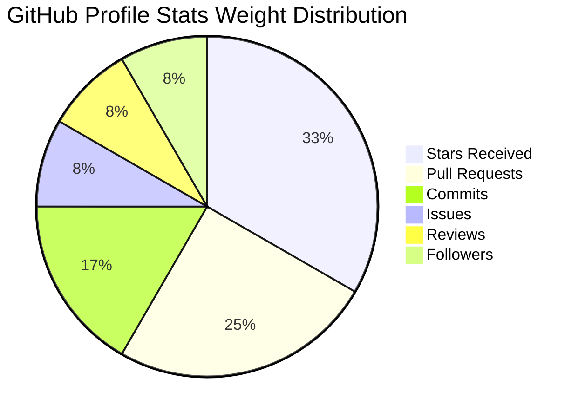

</div>

| 🎯 **Activity** | ⚖️ **Weight** | 📈 **Impact Level** | 💡 **Strategy Focus** |
|:----------------|:--------------|:-------------------|:----------------------|
| ⭐ **Stars Received** | `33.33%` | 🔥 **HIGHEST** | Quality repositories & documentation |
| 🔄 **Pull Requests** | `25.00%` | 🚀 **HIGH** | Open-source contributions |
| 💻 **Commits** | `16.67%` | 📊 **MODERATE** | Consistent coding activity |
| 🐛 **Issues** | `8.33%` | 📝 **LOWER** | Community engagement |
| 👀 **Reviews** | `8.33%` | 🔍 **LOWER** | Code review participation |
| 👥 **Followers** | `8.33%` | 🌟 **LOWER** | Community recognition |

---

### 🛠️ Setting Up GitHub Profile Stats

<details>
<summary>📋 <strong>Step-by-Step Setup Guide</strong></summary>

#### **Step 1: Create Your Profile Repository**
Create a repository with the same name as your GitHub username:
```
your-username/your-username
```

#### **Step 2: Add the Stats Card**
```html
<div align="center">
  
</div>
```

</details>

---

### 🎨 Advanced Configuration Options

<div align="center">

| 🌈 **Theme** | 🔧 **Configuration** | 🎯 **Purpose** |
|:-------------|:---------------------|:---------------|
| `&count_private=true` | Include private repos | Boost commit count |
| `&include_all_commits=true` | All commits counted | Complete activity picture |
| `&theme=tokyonight` | Visual aesthetics | Professional appearance |
| `&show_icons=true` | Visual icons | Enhanced readability |
| `&hide_border=true` | Clean borders | Modern look |

</div>

#### 🎨 Popular Theme Showcase

<div align="center">

```
🌙 dark        🔥 radical      🌲 merko        📊 gruvbox
🌃 tokyonight  🌑 onedark      ⚡ cobalt       🌊 synthwave
🎭 dracula     🌈 highcontrast  and many more...
```

</div>

---

## 🏆 GitHub Profile Trophies: Complete Guide

<div align="center">

### 🎖️ Trophy Ranking Hierarchy

</div>

<div align="center">

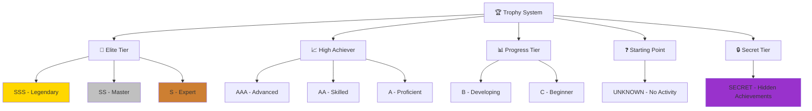

</div>

| 🎖️ **Rank Level** | 📝 **Description** | ✨ **Achievement Status** | 🎯 **Bragging Rights** |
|:------------------|:-------------------|:--------------------------|:------------------------|
| 🌟 **SSS, SS, S** | Elite tier achievements | Ultra-rare accomplishments | 🏆 **Legendary Status** |
| 📈 **AAA, AA, A** | High achiever tier | Consistent effort results | 🚀 **Impressive Level** |
| 📊 **B, C** | Progress tier | Good momentum building | 📈 **On the Right Track** |
| ❓ **UNKNOWN (?)** | No activity detected | Time to start your journey | 🌱 **Ready to Begin** |
| 🔒 **SECRET** | Hidden achievements | Very rare, undisclosed conditions | 🎭 **Mystery Master** |

---

## 🏆 Detailed Trophy Requirements & Strategy

<div align="center">

### 💻 Commits Trophy
*Tracks your total commit count across all repositories*

</div>

<div align="center">

| 🎖️ **Rank** | 🏷️ **Title** | 📊 **Required** | 🎯 **Strategy** |
|:------------|:--------------|:----------------|:----------------|
| 🌟 **SSS** | God Committer | `4,000+ commits` | 🔥 Daily coding habits |
| ⭐ **SS** | Deep Committer | `2,000+ commits` | 📈 Consistent long-term work |
| 🏅 **S** | Super Committer | `1,000+ commits` | 💪 Serious dedication |
| 🥇 **AAA** | Ultra Committer | `500+ commits` | 🎯 Focused development |
| 🥈 **AA** | Hyper Committer | `200+ commits` | 📊 Regular contributor |
| 🥉 **A** | High Committer | `100+ commits` | 🌱 Growing developer |
| 📈 **B** | Middle Committer | `10+ commits` | 🚀 Getting started |
| 🌱 **C** | First Commit | `1+ commits` | ✨ Welcome to GitHub! |

</div>

---

<div align="center">

### ⭐ Stars Trophy
*Based on total stars received across all repositories*

</div>

<div align="center">

| 🎖️ **Rank** | 🏷️ **Title** | ⭐ **Required** | 💡 **Pro Tips** |
|:------------|:--------------|:----------------|:-----------------|
| 🌟 **SSS** | Super Stargazer | `2,000+ stars` | 🚀 Viral project creation |
| ⭐ **SS** | High Stargazer | `700+ stars` | 📊 Multiple successful repos |
| 🏅 **S** | Stargazer | `200+ stars` | 💎 Quality over quantity |
| 🥇 **AAA** | Super Star | `100+ stars` | 📝 Great documentation |
| 🥈 **AA** | High Star | `50+ stars` | 🎯 Useful tools/libraries |
| 🥉 **A** | You are a Star | `30+ stars` | 🌟 Growing recognition |
| 📈 **B** | Middle Star | `10+ stars` | 📊 Building momentum |
| 🌱 **C** | First Star | `1+ stars` | ⭐ First appreciation! |

</div>

---

<div align="center">

### 👥 Followers Trophy
*Counts your total GitHub followers*

</div>

<div align="center">

| 🎖️ **Rank** | 🏷️ **Title** | 👥 **Required** | 🌟 **Community Building** |
|:------------|:--------------|:----------------|:---------------------------|
| 🌟 **SSS** | Super Celebrity | `1,000+ followers` | 🎭 GitHub influencer status |
| ⭐ **SS** | Ultra Celebrity | `400+ followers` | 📢 Strong community presence |
| 🏅 **S** | Hyper Celebrity | `200+ followers` | 🌐 Well-known contributor |
| 🥇 **AAA** | Famous User | `100+ followers` | 💫 Recognized expertise |
| 🥈 **AA** | Active User | `50+ followers` | 🤝 Growing network |
| 🥉 **A** | Dynamic User | `20+ followers` | 📈 Engaging with community |
| 📈 **B** | Many Friends | `10+ followers` | 👋 Making connections |
| 🌱 **C** | First Friend | `1+ followers` | 🎉 Someone noticed you! |

</div>

---

<div align="center">

### 🔄 Pull Requests Trophy
*Based on total pull requests created*

</div>

<div align="center">

| 🎖️ **Rank** | 🏷️ **Title** | 🔄 **Required** | 🚀 **Contribution Strategy** |
|:------------|:--------------|:----------------|:------------------------------|
| 🌟 **SSS** | God Puller | `1,000+ PRs` | 🏆 Open-source champion |
| ⭐ **SS** | Deep Puller | `500+ PRs` | 🌊 Consistent contributor |
| 🏅 **S** | Super Puller | `200+ PRs` | 💪 Serious collaborator |
| 🥇 **AAA** | Ultra Puller | `100+ PRs` | 🎯 Regular contributor |
| 🥈 **AA** | Hyper Puller | `50+ PRs` | 📊 Active participant |
| 🥉 **A** | High Puller | `20+ PRs` | 🌱 Growing contributor |
| 📈 **B** | Middle Puller | `10+ PRs` | 🚀 Getting involved |
| 🌱 **C** | First Pull | `1+ PRs` | ✨ First contribution! |

</div>

---

<div align="center">

### 🐛 Issues Trophy
*Tracks total issues created across repositories*

</div>

<div align="center">

| 🎖️ **Rank** | 🏷️ **Title** | 🐛 **Required** | 📝 **Quality Focus** |
|:------------|:--------------|:----------------|:---------------------|
| 🌟 **SSS** | God Issuer | `1,000+ issues` | 🔍 Master bug hunter |
| ⭐ **SS** | Deep Issuer | `500+ issues` | 📊 Systematic reporter |
| 🏅 **S** | Super Issuer | `200+ issues` | 💎 Quality feedback |
| 🥇 **AAA** | Ultra Issuer | `100+ issues` | 🎯 Helpful suggestions |
| 🥈 **AA** | Hyper Issuer | `50+ issues` | 📈 Active reporter |
| 🥉 **A** | High Issuer | `20+ issues` | 🌱 Contributing feedback |
| 📈 **B** | Middle Issuer | `10+ issues` | 🚀 Getting started |
| 🌱 **C** | First Issue | `1+ issues` | ✨ First report! |

</div>

---

<div align="center">

### 📚 Repositories Trophy
*Based on total public repositories created*

</div>

<div align="center">

| 🎖️ **Rank** | 🏷️ **Title** | 📚 **Required** | 🎨 **Creative Strategy** |
|:------------|:--------------|:----------------|:-------------------------|
| 🌟 **SSS** | God Repo Creator | `100+ repositories` | 🏆 Prolific creator |
| ⭐ **SS** | Deep Repo Creator | `90+ repositories` | 🌊 Consistent builder |
| 🏅 **S** | Super Repo Creator | `80+ repositories` | 💪 Serious developer |
| 🥇 **AAA** | Ultra Repo Creator | `50+ repositories` | 🎯 Multi-project focus |
| 🥈 **AA** | Hyper Repo Creator | `30+ repositories` | 📊 Active creator |
| 🥉 **A** | High Repo Creator | `20+ repositories` | 🌱 Building portfolio |
| 📈 **B** | Middle Repo Creator | `10+ repositories` | 🚀 Getting creative |
| 🌱 **C** | First Repository | `1+ repositories` | ✨ First project! |

</div>

---

<div align="center">

### 👀 Reviews Trophy
*Counts total code reviews completed*

</div>

<div align="center">

| 🎖️ **Rank** | 🏷️ **Title** | 👀 **Required** | 🔍 **Review Excellence** |
|:------------|:--------------|:----------------|:-------------------------|
| 🌟 **SSS** | God Reviewer | `70+ reviews` | 🏆 Code quality guardian |
| ⭐ **SS** | Deep Reviewer | `57+ reviews` | 🌊 Thorough examiner |
| 🏅 **S** | Super Reviewer | `45+ reviews` | 💪 Detail-oriented |
| 🥇 **AAA** | Ultra Reviewer | `30+ reviews` | 🎯 Quality focused |
| 🥈 **AA** | Hyper Reviewer | `20+ reviews` | 📊 Active reviewer |
| 🥉 **A** | Active Reviewer | `8+ reviews` | 🌱 Contributing wisdom |
| 📈 **B** | Intermediate Reviewer | `3+ reviews` | 🚀 Learning to review |
| 🌱 **C** | New Reviewer | `1+ reviews` | ✨ First review! |

</div>

---

<div align="center">

### ⏰ Experience Trophy
*Based on account age (time-based achievement)*

</div>

<div align="center">

| 🎖️ **Rank** | 🏷️ **Title** | ⏰ **Account Age** | 🎓 **Wisdom Level** |
|:------------|:--------------|:-------------------|:--------------------|
| 🌟 **SSS** | Seasoned Veteran | `~20+ years` | 🧙‍♂️ Ancient wisdom |
| ⭐ **SS** | Grandmaster | `~15+ years` | 👴 Old-school expert |
| 🏅 **S** | Master Dev | `~10+ years` | 🎓 Decade of experience |
| 🥇 **AAA** | Expert Dev | `~7.5+ years` | 💡 Senior developer |
| 🥈 **AA** | Experienced Dev | `~5+ years` | 📊 Mid-level expertise |
| 🥉 **A** | Intermediate Dev | `~3+ years` | 🌱 Growing experience |
| 📈 **B** | Junior Dev | `~1.5+ years` | 🚀 Building skills |
| 🌱 **C** | Newbie | `~0.5+ years` | ✨ Fresh start! |

</div>

---

## 🎭 Secret Trophies: Hidden Achievements

<div align="center">

### 🔒 Unlock the Mysteries

</div>

<div align="center">

| 🏆 **Trophy** | 🎭 **Title** | 🔓 **Requirement** | 🌟 **Rarity** |
|:--------------|:----------------|:-------------------|:---------------|
| 🌈 **MultiLanguage** | Rainbow Lang User | `10+ languages` | 🎨 Polyglot programmer |
| ⭐ **AllSuperRank** | S Rank Hacker | `All trophies S+` | 🏆 Ultimate achievement |
| 🏢 **Organizations** | Jack of all Trades | `3+ organizations` | 🤝 Team player |
| ⏳ **LongTimeUser** | Village Elder | `10+ years` | 👴 Time-tested veteran |
| 🎉 **Joined2020** | Everything started... | `Joined in 2020` | 📅 Pandemic coder |
| 🏛️ **AncientUser** | Ancient User | `Joined before 2010` | 🏺 GitHub archaeology |
| 👑 **OGUser** | OG User | `Joined in 2008` | 👑 Original GitHub royalty |

</div>

---

### 🛠️ Setting Up GitHub Profile Trophies

<details>
<summary>⚙️ <strong>Implementation Guide</strong></summary>

#### **Basic Implementation:**
```markdown
<div align="center">
  
</div>
```

#### **Advanced Configuration:**
```markdown
<div align="center">
  
</div>
```

</details>

---

### 🎨 Customization Showcase

<div align="center">

| 🎨 **Option** | ⚙️ **Parameter** | 🎯 **Effect** |
|:--------------|:-----------------|:--------------|
| 🌈 **Themes** | `theme=onedark` | Visual aesthetics |
| 📐 **Layout** | `column=6` | Trophy arrangement |
| 🎯 **Filtering** | `rank=S,AAA` | Show specific ranks |
| 🖼️ **Visual** | `no-bg=true` | Transparent background |

</div>

---

## 🏅 GitHub Achievements: Native Badges

<div align="center">

### 🎖️ Official Recognition System

</div>

GitHub Achievements are **native badges** awarded automatically by GitHub itself (not third-party services). Unlike trophies and stats, these appear directly on your profile and represent specific milestone accomplishments across the platform.

<div align="center">

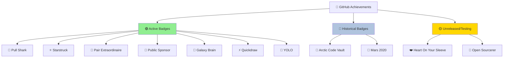

</div>

---

### 🟢 Active Badges: Currently Earnable

<div align="center">

#### 🦈 Pull Shark
*Merge pull requests to build your contribution history*

</div>

<div align="center">

| 🎖️ **Tier** | 📊 **Requirement** | 🎯 **Difficulty** | 💡 **Strategy** |
|:------------|:-------------------|:------------------|:----------------|
| 🥉 **Bronze** | `2 merged PRs` | 🌱 **Beginner** | Fix typos in docs, update README files |
| 🥈 **Silver** | `16 merged PRs` | 📈 **Intermediate** | Contribute to good-first-issue tags |
| 🥇 **Gold** | `128 merged PRs` | 🏆 **Advanced** | Regular OSS contributions + own projects |
| 💎 **Diamond** | `1,024 merged PRs` | 👑 **Elite** | Long-term dedication across multiple repos |

</div>

<details>
<summary>📘 <strong>Earning Strategy & Tips</strong></summary>

**Quick Wins:**
- Start with documentation improvements (typos, clarity, examples)
- Look for repositories with `good-first-issue` labels
- Contribute to projects you already use and understand

**Medium-term Growth:**
- Establish regular contribution schedule (2-3 PRs/week)
- Mix your own projects with external contributions
- Focus on quality over quantity—merged PRs count

**Long-term Excellence:**
- Maintain your own active open-source projects
- Become a regular contributor to major projects
- Review and help merge others' PRs (as maintainer)

</details>

---

<div align="center">

#### ⭐ Starstruck
*Create repositories that resonate with the community*

</div>

<div align="center">

| 🎖️ **Tier** | ⭐ **Stars Required** | 🎯 **Difficulty** | 💡 **Project Ideas** |
|:------------|:---------------------|:------------------|:---------------------|
| 🥉 **Bronze** | `16 stars` | 📊 **Moderate** | Useful tool, tutorial series, curated list |
| 🥈 **Silver** | `128 stars` | 🚀 **Challenging** | Popular library, framework, comprehensive guide |
| 🥇 **Gold** | `512 stars` | 🏆 **Difficult** | Innovative solution, viral project |
| 💎 **Diamond** | `4,096 stars` | 👑 **Legendary** | Game-changing tool, major framework |

</div>

<details>
<summary>📘 <strong>Earning Strategy & Tips</strong></summary>

**Project Quality Factors:**
- **Clear README**: Purpose, installation, usage examples, screenshots
- **Active Maintenance**: Regular updates, respond to issues promptly
- **Documentation**: Comprehensive guides, API docs, tutorials
- **Community**: Contributing guidelines, code of conduct

**Promotion Strategies:**
- Share on Reddit (r/programming, language-specific subs)
- Post on Hacker News, Product Hunt, Dev.to
- Engage with Twitter/X tech communities
- Write blog posts explaining your solution
- Create video tutorials or demos

**Content that Gets Stars:**
- 🛠️ Developer tools solving real pain points
- 📚 Awesome lists and curated resources
- 🎓 Comprehensive learning paths/tutorials
- 🎨 UI/UX libraries and component collections
- 🔥 Trending topic implementations (AI, Web3, etc.)

</details>

---

<div align="center">

#### 🤝 Pair Extraordinaire
*Collaborate effectively through co-authorship*

</div>

<div align="center">

| 🎖️ **Tier** | 📊 **Requirement** | 🎯 **Difficulty** | 💡 **Collaboration Type** |
|:------------|:-------------------|:------------------|:--------------------------|
| 🥉 **Bronze** | `1 co-authored PR` | 🌱 **Easy** | Pair programming session |
| 🥈 **Silver** | `10 co-authored PRs` | 📈 **Moderate** | Regular team collaboration |
| 🥇 **Gold** | `24 co-authored PRs` | 🏆 **Advanced** | Active collaborative projects |
| 💎 **Diamond** | `48 co-authored PRs` | 👑 **Elite** | Leadership in team development |

</div>

<details>
<summary>📘 <strong>Earning Strategy & Tips</strong></summary>

**How to Add Co-Authors:**

Add co-author information to your commit messages using this format:

```bash
git commit -m "feat: implement new feature

Co-authored-by: Name <email@example.com>
Co-authored-by: Another Name <another@example.com>"
```

**Or use GitHub Desktop/VS Code:**
- GitHub Desktop: Click "Add Co-Authors" in commit panel
- VS Code: Use Git extension's co-author feature

**When to Co-Author:**
- 👥 Pair programming sessions
- 🤝 Mob programming with the team
- 💡 Significant code review contributions
- 🔧 Debugging sessions solving complex issues
- 📚 Collaborative documentation efforts

**Best Practices:**
- Always ask permission before adding someone as co-author
- Be generous—credit others for meaningful contributions
- Use correct email addresses (GitHub account emails)
- Document who did what in the commit message body

</details>

---

<div align="center">

#### 💜 Public Sponsor
*Support the open-source ecosystem*

</div>

<div align="center">

| 🎖️ **Tier** | 💰 **Requirement** | 🎯 **Difficulty** | 💡 **Impact** |
|:------------|:-------------------|:------------------|:--------------|
| 🥉 **Bronze** | Sponsor 1 account | 🌱 **Very Easy** | $1-5/month makes a difference |
| 🥈 **Silver** | Sponsor 10 accounts | 📊 **Easy** | Support multiple maintainers |
| 🥇 **Gold** | Sponsor 30 accounts | 📈 **Moderate** | Significant ecosystem contributor |
| 💎 **Diamond** | Sponsor 90 accounts | 🏆 **Dedicated** | Major open-source supporter |

</div>

<details>
<summary>📘 <strong>Earning Strategy & Tips</strong></summary>

**Getting Started:**
1. Visit GitHub Sponsors: `github.com/sponsors`
2. Find maintainers of tools/projects you use
3. Choose a tier (even $1/month counts!)
4. Badge appears immediately on your profile

**Who to Sponsor:**
- 🛠️ Maintainers of tools you use daily
- 📚 Creators of educational content you value
- 🌟 Projects critical to your workflow
- 🌱 Early-stage projects you want to support

**Strategic Approach:**
- Start with 1-3 sponsorships you really believe in
- Gradually expand as your budget allows
- Consider sponsoring through your company
- Combine with Open Collective for broader impact

**Benefits Beyond the Badge:**
- ✨ Sponsor-only updates and early access
- 🤝 Direct relationship with maintainers
- 💼 Networking opportunities
- 😊 Satisfaction of supporting OSS sustainability

</details>

---

<div align="center">

#### 🧠 Galaxy Brain
*Share knowledge through GitHub Discussions*

</div>

<div align="center">

| 🎖️ **Tier** | 🎯 **Requirement** | 📊 **Difficulty** | 💡 **Focus Area** |
|:------------|:-------------------|:------------------|:------------------|
| 🥉 **Bronze** | 2 accepted answers | 🌱 **Beginner** | Answer questions you know well |
| 🥈 **Silver** | 8 accepted answers | 📈 **Intermediate** | Regular participation |
| 🥇 **Gold** | 16 accepted answers | 🏆 **Advanced** | Subject matter expertise |
| 💎 **Diamond** | 32 accepted answers | 👑 **Expert** | Recognized authority |

</div>

<details>
<summary>📘 <strong>Earning Strategy & Tips</strong></summary>

**Finding Opportunities:**
- Visit repositories with active Discussions enabled
- Check Q&A categories in popular projects
- Follow topics/technologies you're expert in
- Subscribe to notifications for specific repos

**Writing Accepted Answers:**
- ✅ **Be specific**: Include code examples, not just explanations
- ✅ **Be complete**: Address the entire question
- ✅ **Be clear**: Use formatting, headers, code blocks
- ✅ **Be helpful**: Link to docs, explain *why* not just *how*
- ✅ **Be timely**: Early answers have higher acceptance rates

**Topics with Active Discussions:**
- Major frameworks (React, Next.js, Vue, etc.)
- Developer tools (VS Code, Git, Docker)
- Programming languages (Python, JavaScript, Rust)
- Cloud platforms and services

**Pro Tips:**
- Answer questions even if not marked as Q&A—still counts
- Update answers when new information becomes available
- Be patient—acceptance is up to the asker
- Focus on quality over quantity

</details>

---

<div align="center">

#### ⚡ Quickdraw
*Demonstrate fast issue/PR management*

</div>

<div align="center">

| 🎖️ **Tier** | 🎯 **Requirement** | ⏰ **Time Limit** | 💡 **Use Cases" |
|:------------|:-------------------|:------------------|:-----------------|
| 🥉 **Bronze** | Close 1 within 5min | `< 5 minutes` | Duplicate issues, quick fixes |
| 🥈 **Silver** | Close 8 within 5min | `< 5 minutes` | Active issue triage |
| 🥇 **Gold** | Close 16 within 5min | `< 5 minutes` | Efficient repo management |
| 💎 **Diamond** | Close 32 within 5min | `< 5 minutes` | Lightning-fast responses |

</div>

<details>
<summary>📘 <strong>Earning Strategy & Tips</strong></summary>

**Legitimate Quick Closes:**
- 🔄 Duplicate issues (link to original)
- ❌ Spam or invalid reports
- ✅ Already fixed in latest version
- 📝 Insufficient information after clarification
- 🎯 Working as intended / not a bug
- 🚀 Hot-fix PRs for critical issues

**Workflow for Quick Response:**
```bash
# 1. Create issue (or receive one)
# 2. Immediately assess if closeable
# 3. Add brief comment explaining closure
# 4. Close within 5 minutes of creation
```

**⚠️ Important Notes:**
- Only works on issues/PRs you opened or have triage access to
- Must be closed within 5 minutes of **opening**
- Requires justification—don't abuse for badge farming
- Works best as maintainer managing your repos

**Ethical Approach:**
- Use for legitimate triaging, not gaming
- Always explain why you're closing quickly
- Link to duplicates or relevant documentation
- Consider community perception

</details>

---

<div align="center">

#### 🎲 YOLO
*Merge without review (use responsibly!)*

</div>

<div align="center">

| 🎖️ **Tier** | 🎯 **Requirement** | ⚠️ **Risk Level** | 💡 **Safe Scenarios" |
|:------------|:-------------------|:------------------|:----------------------|
| 🥉 **Bronze** | Merge 1 PR no review | ⚠️ **Risky** | Personal projects, docs |
| 🥈 **Silver** | Merge 8 PRs no review | ⚠️⚠️ **Very Risky** | Solo projects only |
| 🥇 **Gold** | Merge 16 PRs no review | ⚠️⚠️⚠️ **Dangerous** | Not recommended |
| 💎 **Diamond** | Merge 32 PRs no review | 🚨 **Critical** | Avoid in production |

</div>

<details>
<summary>📘 <strong>Earning Strategy & Tips</strong></summary>

**When YOLO is Acceptable:**
- 🏠 Personal/hobby projects
- 📝 Documentation-only changes
- 🎨 Visual tweaks on personal sites
- 🔧 Small config adjustments
- ⚡ Critical hot-fixes (explain in commit)

**⚠️ NEVER YOLO:**
- ❌ Production applications with users
- ❌ Team projects without consent
- ❌ Security-related changes
- ❌ Database migrations
- ❌ Infrastructure/deployment code

**How to Merge Without Review:**
```bash
# In your repo settings:
Settings → Branches → Uncheck "Require approvals"

# Or use admin override when needed
# (Available if you're repo admin)
```

**Badge Philosophy:**
- GitHub knows this isn't best practice
- Badge name literally says "You Only Live Once"
- It's a humorous acknowledgment of reality
- Don't chase this badge at expense of code quality

</details>

---

### 🔵 Historical Badges: No Longer Earnable

<div align="center">

| 🏅 **Badge** | 📅 **Event/Period" | 🌟 **Significance** |
|:-------------|:-------------------|:--------------------|
| 🧊 **Arctic Code Vault Contributor** | 2020 GitHub Archive Program | Code preserved in Arctic World Archive (Svalbard) |
| 🚁 **Mars 2020 Contributor** | 2020 Mars Mission | Contributed to code used in Mars Helicopter mission |

</div>

These badges commemorate historic GitHub initiatives and can no longer be earned. If you have them, they represent participation in groundbreaking preservation and space exploration projects.

---

### 🟡 Unreleased/Testing Badges

<div align="center">

| 🏅 **Badge** | 🔬 **Status** | 📝 **Notes** |
|:-------------|:--------------|:-------------|
| ❤️ **Heart On Your Sleeve** | Limited beta testing | React with ❤️ emoji—may not appear for all users yet |
| 🧙 **Open Sourcerer** | Unannounced | Criteria not publicly disclosed by GitHub |

</div>

These badges are either in testing or have unconfirmed criteria. Stay active and they may appear on your profile in the future!

---

> 🔒 **Important**: Achievements are automatic—no manual toggles. GitHub has not published exact numeric thresholds for all badge tiers, so focus on steady contributions and quality projects.

<div align="center">

### 🔎 Managing Your Achievements

</div>

**Viewing Your Badges:**

1. **Profile Page**: Navigate to `github.com/your-username`
2. **Achievements Section**: Scroll to the achievements panel (below pinned repos)
3. **Badge Details**: Hover over any badge to see:
   - 🎯 What it represents
   - 📊 Current tier (Bronze/Silver/Gold/Diamond)
   - 📈 Progress to next tier
   - 🗓️ Date earned

**Privacy Controls:**

- Click any badge → **"Show/Hide"** toggle
- Hidden badges don't appear on your public profile
- You can still see them when logged in
- Unhide anytime from achievement settings

**Badge Visibility:**

- ✅ Automatically displayed on profile page
- ✅ Shown in contribution graphs
- ✅ Visible on organization pages (if member)
- ✅ Appear in GitHub Sponsors profile
- ✅ Display in README when using certain widgets

<div align="center">

### ⚡ Strategic Badge Roadmap

</div>

#### 🌱 Beginner Actions (Start Today!)

<div align="center">

| 🎯 **Action** | 🏅 **Badges** | ⏰ **Timeline** | 💡 **First Steps** |
|:-------------|:--------------|:----------------|:--------------------|
| Make your first PR | 🦈 Pull Shark | `1 day` | Fix a typo in any repo's README |
| Sponsor one maintainer | 💜 Public Sponsor | `5 minutes` | Start with $1/month to a project you use |
| Add a co-author | 🤝 Pair Extraordinaire | `1 session` | Pair program with a friend, credit them |
| Answer a discussion | 🧠 Galaxy Brain | `30 minutes` | Find Q&A in repos you know well |

</div>

#### 📈 Intermediate Actions (Build Momentum)

<div align="center">

| 🎯 **Action** | 🏅 **Badges** | ⏰ **Timeline** | 💡 **Strategy" |
|:-------------|:--------------|:----------------|:-----------------|
| Create a useful repo | ⭐ Starstruck | `1-3 months` | Solve a problem others have, document well |
| Contribute weekly | 🦈 Pull Shark | `Ongoing` | Set goal: 2-3 PRs per week to various repos |
| Regular sponsorships | 💜 Public Sponsor | `Ongoing` | Add 1 new sponsor monthly |
| Active in discussions | 🧠 Galaxy Brain | `Weekly` | Dedicate 1 hour/week to helping others |

</div>

#### 🏆 Advanced Actions (Long-term Goals)

<div align="center">

| 🎯 **Action" | 🏅 **Badges** | ⏰ **Timeline** | 💡 **Commitment** |
|:-------------|:--------------|:----------------|:------------------|
| Build viral project | ⭐ Starstruck Gold+ | `6-12 months` | Innovative solution + marketing effort |
| OSS maintainer role | 🦈 Pull Shark Gold+ | `1-2 years` | Regular contributions become maintainership |
| Sponsor ecosystem | 💜 Public Sponsor Gold+ | `Ongoing` | Support 30+ projects you rely on |
| Community expert | 🧠 Galaxy Brain Gold+ | `6 months` | Become go-to person for specific topics |

</div>

---

## 🧭 New to GitHub? Complete Quickstart Tutorial

<div align="center">

### 🎯 Your First 24 Hours on GitHub

</div>

> **Goal**: Go from zero to first contribution with stats, trophies, and badges starting to accumulate!

<div align="center">

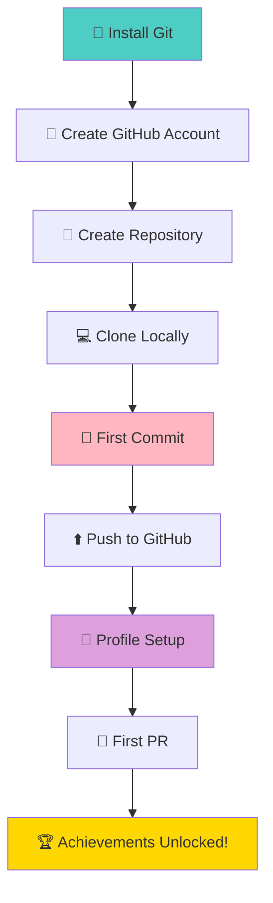

</div>

---

### 📋 Phase 1: Environment Setup (30 minutes)

<details>
<summary><strong>🔧 Step 1: Install Git & Configure</strong></summary>

**Download & Install:**
- **Windows**: Download from [git-scm.com](https://git-scm.com/download/win)
- **Mac**: `brew install git` or download from git-scm.com
- **Linux**: `sudo apt-get install git` (Ubuntu/Debian)

**Verify Installation:**
```bash
git --version
# Should output: git version 2.x.x
```

**Configure Your Identity:**
```bash
# Use your real name and GitHub email
git config --global user.name "Your Full Name"
git config --global user.email "your-email@example.com"

# Set default branch name
git config --global init.defaultBranch main

# Enable colored output (optional but helpful)
git config --global color.ui auto
```

**Verify Configuration:**
```bash
git config --list --global
```

</details>

<details>
<summary><strong>👤 Step 2: Create GitHub Account</strong></summary>

1. **Sign Up**: Visit [github.com/signup](https://github.com/signup)
2. **Choose Username**: Pick something professional (hard to change later!)
   - ✅ Good: `john-smith`, `janedoe-dev`, `alex-codes`
   - ❌ Avoid: `cooldude123`, `xxhackerxx`
3. **Verify Email**: Check inbox and click verification link
4. **Complete Profile**:
   - Add profile picture (professional photo or avatar)
   - Add bio (2-3 sentence description)
   - Add location (city/country)
   - Add website/portfolio link (if you have one)

</details>

<details>
<summary><strong>🔑 Step 3: Set Up Authentication</strong></summary>

**Option A: Personal Access Token (Recommended)**

1. GitHub → Settings → Developer Settings → Personal Access Tokens → Tokens (classic)
2. Click "Generate new token (classic)"
3. Name: `Git Operations`
4. Select scopes: `repo`, `workflow`, `gist`
5. Generate → **Copy token immediately** (can't see again!)
6. Store securely (password manager)

**Option B: SSH Keys (More Secure)**

```bash
# Generate SSH key
ssh-keygen -t ed25519 -C "your-email@example.com"

# Start SSH agent
eval "$(ssh-agent -s)"

# Add key to agent
ssh-add ~/.ssh/id_ed25519

# Copy public key
cat ~/.ssh/id_ed25519.pub
```

Then: GitHub → Settings → SSH and GPG keys → New SSH key → Paste

</details>

---

### 📋 Phase 2: First Repository (45 minutes)

<details>
<summary><strong>📁 Step 4: Create Your Profile README Repository</strong></summary>

**Why Start Here?**
A repository with the same name as your username becomes your profile README—perfect first project!

**Create on GitHub:**
1. Click "+" (top right) → "New repository"
2. **Repository name**: `your-username` (must match exactly!)
3. **Description**: `My GitHub profile README`
4. **Public** (required for profile display)
5. ✅ Check "Add a README file"
6. **License**: MIT (good default for open source)
7. Click "Create repository"

**Notice**: GitHub shows special message about profile README!

</details>

<details>
<summary><strong>💻 Step 5: Clone Repository Locally</strong></summary>

**Using HTTPS (with Personal Access Token):**
```bash
# Clone your repo
git clone https://github.com/your-username/your-username.git

# Enter credentials when prompted:
# Username: your-username
# Password: paste-your-personal-access-token

# Navigate into directory
cd your-username
```

**Using SSH:**
```bash
git clone git@github.com:your-username/your-username.git
cd your-username
```

**Verify Clone:**
```bash
ls -la  # Should see README.md and .git directory
git status  # Should say "On branch main, nothing to commit"
```

</details>

<details>
<summary><strong>📝 Step 6: Make Your First Commit</strong></summary>

**Edit README.md:**

Open `README.md` in your favorite editor and replace with:

```markdown
# Hi there, I'm [Your Name]! 👋

## 🚀 About Me
I'm a [your role/interest] passionate about [your interests].

## 🔭 Current Focus
- 🌱 Learning: [technologies you're learning]
- 💼 Working on: [current projects]
- 🎯 Goals: [your 2026 goals]

## 📊 GitHub Stats
Just getting started on my GitHub journey!

## 📫 Connect With Me
- LinkedIn: [your-profile]
- Email: [your-email]

---
*This README is a work in progress. Check back soon!*
```

**Commit Changes:**
```bash
# Check what changed
git status
# Should show: modified: README.md

# Stage the file
git add README.md

# Or stage all changes
git add .

# Commit with meaningful message
git commit -m "docs: create initial profile README"

# Push to GitHub
git push origin main
```

**🎉 Achievement Unlocked**: First Commit Trophy (C rank)!

</details>

---

### 📋 Phase 3: Profile Enhancement (30 minutes)

<details>
<summary><strong>🎯 Step 7: Add Stats & Trophies to Your Profile</strong></summary>

**Add GitHub Stats Card:**

Edit your README.md again:

```markdown
## 📊 GitHub Stats

<div align="center">


</div>
```

**Commit and Push:**
```bash
git add README.md
git commit -m "feat: add GitHub stats and trophies"
git push origin main
```

**View Your Profile:**
Visit `github.com/your-username` → See your new README with live stats!

</details>

---

### 📋 Phase 4: First Contribution (1-2 hours)

<details>
<summary><strong>🔄 Step 8: Create Your First Pull Request</strong></summary>

**Option A: Contribute to Someone Else's Project**

1. **Find a beginner-friendly project:**
   - Search GitHub for `label:good-first-issue`
   - Visit [firstcontributions.github.io](https://firstcontributions.github.io/)
   - Check [up-for-grabs.net](https://up-for-grabs.net/)

2. **Fork the repository:**
   - Click "Fork" button (top right)
   - Creates copy under your account

3. **Clone your fork:**
   ```bash
   git clone https://github.com/your-username/project-name.git
   cd project-name
   ```

4. **Create feature branch:**
   ```bash
   git checkout -b fix/typo-in-readme
   ```

5. **Make changes:**
   - Fix the typo/issue
   - Test if applicable

6. **Commit and push:**
   ```bash
   git add .
   git commit -m "docs: fix typo in installation section"
   git push origin fix/typo-in-readme
   ```

7. **Open Pull Request:**
   - GitHub will show banner: "Compare & pull request"
   - Click it
   - Write clear title and description
   - Explain what changed and why
   - Submit!

**Option B: Contribute to Your Own Project**

```bash
# In your profile repo
git checkout -b feature/add-badges

# Add some badges to README.md
# Example:
# 

git add README.md
git commit -m "feat: add profile view counter badge"
git push origin feature/add-badges

# Then on GitHub:
# Create pull request from feature/add-badges to main
# Review your own changes
# Merge!
```

**🎉 Achievement Unlocked**: Pull Shark (Bronze)!

</details>

---

### 🧰 Troubleshooting Common Issues

<details>
<summary><strong>❌ "Permission denied" when pushing</strong></summary>

**Problem**: Authentication failed

**Solution**:
```bash
# For HTTPS: Use Personal Access Token as password (not GitHub password)
# For SSH: Ensure SSH key is added to GitHub

# Test SSH connection:
ssh -T git@github.com
# Should say: "Hi username! You've successfully authenticated..."
```

</details>

<details>
<summary><strong>❌ "fatal: not a git repository"</strong></summary>

**Problem**: You're not in a Git directory

**Solution**:
```bash
# Check current directory
pwd

# Navigate to your repo
cd path/to/your-username

# Verify it's a git repo
ls -la .git
```

</details>

<details>
<summary><strong>❌ "Your branch is behind 'origin/main'"</strong></summary>

**Problem**: Remote has changes you don't have locally

**Solution**:
```bash
# Pull latest changes
git pull origin main

# Or if you have local changes:
git stash  # Save local changes
git pull origin main
git stash pop  # Reapply local changes
```

</details>

<details>
<summary><strong>❌ "Merge conflict" after pull</strong></summary>

**Problem**: Same lines changed both locally and remotely

**Solution**:
```bash
# Open conflicted file(s)
# Look for markers:
# <<<<<<< HEAD
# Your changes
# =======
# Their changes
# >>>>>>> branch-name

# Edit file to resolve conflict (remove markers, keep what you want)

git add resolved-file.md
git commit -m "merge: resolve conflict in README"
git push origin main
```

</details>

<details>
<summary><strong>❌ Stats/Trophies not showing on profile</strong></summary>

**Common Causes**:
- ✅ Repository must be named exactly like your username
- ✅ Repository must be **public**
- ✅ README.md must be in root directory
- ✅ Wait 5-10 minutes for GitHub to update
- ✅ Check image URLs are correct (replace `your-username`)
- ✅ Hard refresh browser (Ctrl+Shift+R or Cmd+Shift+R)

</details>

---

### ⚠️ Common Pitfalls to Avoid

<div align="center">

| ❌ **Mistake** | ✅ **Best Practice** | 💡 **Why It Matters** |
|:---------------|:---------------------|:----------------------|
| Committing to `main` directly | Always use feature branches | Easier to review, safer workflow |
| Vague commit messages | Use conventional commits format | Clear project history |
| Pushing sensitive data | Use `.gitignore`, check before commit | Security & privacy |
| Not pulling before starting work | `git pull` first thing each session | Avoid merge conflicts |
| Huge commits with many changes | Small, focused commits | Easier to review & debug |
| Ignoring code reviews | Engage with feedback constructively | Learn & improve code quality |

</div>

---

### 🚀 Next Steps: Your First Week

<div align="center">

#### Day 1-2: Profile Foundation
- ✅ Complete all setup steps above
- ✅ Create profile README with stats/trophies
- ✅ Make 3-5 commits (practice workflow)
- ✅ Open and merge your first PR

#### Day 3-4: First Real Contribution
- 🔍 Find a good-first-issue in a project you use
- 📝 Read contributing guidelines carefully
- 🤝 Make your first external contribution
- 💬 Engage with reviewers professionally

#### Day 5-6: Build Something
- 🛠️ Create a small useful project (tool, script, tutorial)
- 📚 Write comprehensive README
- 🎨 Add screenshots/examples
- 📢 Share on social media

#### Day 7: Engage with Community
- 💜 Sponsor at least one maintainer ($1-5/month)
- 🧠 Answer a question in GitHub Discussions
- 👥 Follow developers whose work you admire
- ⭐ Star projects you find useful

</div>

---

### 📚 Essential Resources for Beginners

<div align="center">

| 📖 **Resource** | 🎯 **Purpose** | 🔗 **Link** |
|:----------------|:---------------|:------------|
| **GitHub Skills** | Interactive tutorials | [skills.github.com](https://skills.github.com) |
| **Git Handbook** | Git fundamentals | [guides.github.com/introduction/git-handbook](https://guides.github.com/introduction/git-handbook/) |
| **First Contributions** | Practice PR workflow | [firstcontributions.github.io](https://firstcontributions.github.io) |
| **Conventional Commits** | Commit message guide | [conventionalcommits.org](https://www.conventionalcommits.org) |
| **Choose a License** | Pick right license | [choosealicense.com](https://choosealicense.com) |
| **GitHub Docs** | Official documentation | [docs.github.com](https://docs.github.com) |

</div>

---

### 🎯 Beginner Success Checklist

<div align="center">

| ✅ **Milestone** | 🎯 **Achievement** | 🏆 **Unlocks" |
|:-----------------|:-------------------|:---------------|
| First commit | Repository created and committed | 💻 Commits Trophy (C) |
| Profile README | Enhanced profile visibility | 📊 Better first impression |
| First PR merged | Contribution accepted | 🦈 Pull Shark (Bronze) |
| First star received | Someone finds your work useful | ⭐ Starstruck (Bronze) potential |
| First sponsorship | Supporting open source | 💜 Public Sponsor (Bronze) |
| First Discussion answer | Helping the community | 🧠 Galaxy Brain (Bronze) potential |
| 10 commits | Regular activity established | 💻 Commits Trophy (B) |
| 5 PRs merged | Consistent contributor | 🦈 Pull Shark progress |

</div>

<div align="center">

### 🎓 30-Day Beginner Challenge

</div>

**Week 1: Foundation**

<div align="center">

| ✅ **Task** | 🎯 **Impact" | 🏆 **Progress Toward** |
|:-----------|:------------|:-----------------------|
| Create profile README repo | Profile visibility | 💻 First Repository |
| Add stats/trophies to profile | Professional showcase | 📊 Profile enhancement |
| Make 5 meaningful commits | Build commit history | 💻 Commits (B rank) |
| Star 10 useful repositories | Curate your interests | 🌟 Community engagement |

</div>

**Week 2: First Contributions**

<div align="center">

| ✅ **Task** | 🎯 **Impact** | 🏆 **Progress Toward** |
|:-----------|:------------|:-----------------------|
| Find and fix a documentation typo | Safe first PR | 🦈 Pull Shark (Bronze) |
| Open an issue on a project you use | Provide feedback | 🐛 Issues (C rank) |
| Create a simple useful repo | Share your work | ⭐ Starstruck potential |
| Use `Co-authored-by` in a commit | Practice collaboration | 🤝 Pair Extraordinaire |

</div>

**Week 3: Community Engagement**

<div align="center">

| ✅ **Task** | 🎯 **Impact** | 🏆 **Progress Toward** |
|:-----------|:------------|:-----------------------|
| Answer 2 GitHub Discussions | Share knowledge | 🧠 Galaxy Brain (Bronze) |
| Sponsor 1 maintainer ($1/mo) | Support ecosystem | 💜 Public Sponsor (Bronze) |
| Review someone's PR (if possible) | Learn review process | 👀 Reviews (C rank) |
| Follow 10 developers you admire | Build network | 👥 Follower growth |

</div>

**Week 4: Growth & Consistency**

<div align="center">

| ✅ **Task** | 🎯 **Impact** | 🏆 **Progress Toward** |
|:-----------|:------------|:-----------------------|
| Contribute to 3 different projects | Diverse experience | 🦈 Pull Shark (Silver) path |
| Update profile README with learnings | Document journey | 📚 Professional growth |
| Share your favorite project on social | Promote good work | 🌐 Community building |
| Commit every day for 7 days | Build consistency | 💻 Commit streak |

</div>

---

### 💡 Pro Tips for Beginners

<div align="center">

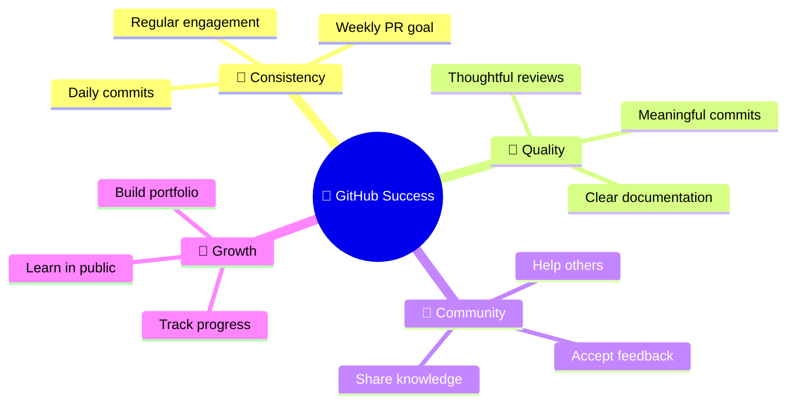

</div>

---

## 🚀 Strategic Improvement Guide

<div align="center">

### 📈 Boost Your GitHub Profile Stats Rank

</div>

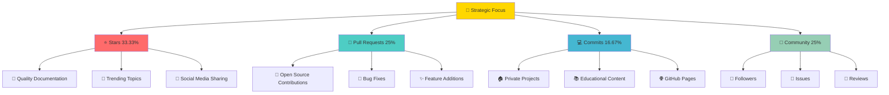

---

### 🎯 Trophy Earning Strategies

<div align="center">

#### 🏃‍♂️ Quick Wins (Start Here!)
| 🎯 **Target** | 📊 **Effort** | ⏰ **Timeline** |
|:-------------|:---------------|:----------------|
| 📚 **Repositories (C-B)** | `1-10 repos` | 🕐 1-2 weeks |
| 💻 **Commits (C-B)** | `1-10 commits` | 🕐 Few days |
| 🐛 **Issues (C)** | `1 issue` | 🕐 1 day |
| 👀 **Reviews (C)** | `1 review` | 🕐 1 day |

#### 📈 Medium-term Goals (Build Momentum)
| 🎯 **Target** | 📊 **Effort** | ⏰ **Timeline** |
|:-------------|:---------------|:----------------|
| ⭐ **Stars (A-AA)** | `30-50 stars` | 🕑 2-6 months |
| 👥 **Followers (A-AA)** | `20-50 followers` | 🕑 3-6 months |
| 🔄 **Pull Requests (A-AA)** | `20-50 PRs` | 🕑 3-6 months |

#### 🏆 Long-term Achievements (Dedication Required)
| 🎯 **Target** | 📊 **Effort** | ⏰ **Timeline** |
|:-------------|:---------------|:----------------|
| 💻 **Commits (S+)** | `1,000+ commits` | 🕒 1-2 years |
| ⭐ **Stars (S+)** | `200+ stars` | 🕒 1-3 years |
| ⏰ **Experience (AAA+)** | `7.5+ years` | 🕓 Time-based |

#### 👑 Elite Tier (For Legends)
| 🎯 **Target** | 📊 **Effort** | ⏰ **Timeline** |
|:-------------|:---------------|:----------------|
| 🌟 **Any SSS rank** | `Exceptional dedication` | 🕕 2-5 years |
| 🔒 **Secret trophies** | `Diverse activities` | 🕕 Ongoing |

</div>

---

## 💡 Best Practices for Both Systems

<div align="center">

### 🎨 Content Strategy Diversification

</div>

GitHub isn't just for code! Expand your impact with diverse content:

<div align="center">

| 📝 **Content Type** | 🎯 **Examples** | 💰 **Stats Impact** |
|:--------------------|:----------------|:---------------------|
| 📚 **Documentation** | Tutorials, guides, best practices | ⭐ High stars potential |
| 🎓 **Educational** | Course materials, learning resources | 👥 Follower growth |
| 🎨 **Creative Works** | Design assets, writing, compositions | 💻 Commit diversity |
| 🔬 **Research** | Academic papers, data analysis | 🔄 Collaboration opportunities |
| 🛠️ **Personal Tools** | Automation scripts, productivity tools | ⭐ Practical value |

</div>

---

### 🤝 Community Engagement Excellence

<div align="center">

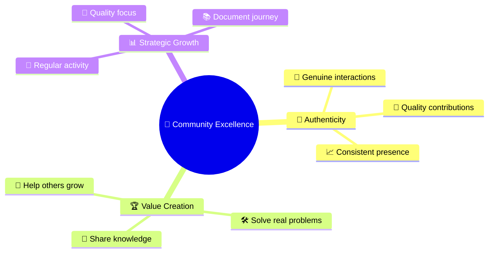

</div>

---

## 🎪 Complete Implementation Showcase

<div align="center">

### 🌟 Your Ultimate GitHub Profile Setup

</div>

```markdown
<div align="center">

# 👋 Hi there, I'm [Your Name]!


[](https://git.io/typing-svg)

</div>

---

## 📊 GitHub Statistics

<div align="center">


</div>

---

## 🏆 GitHub Trophies

<div align="center">


</div>

---

## 📈 Contribution Graph

<div align="center">


</div>

---

## 🛠️ Tech Stack

<div align="center">


</div>

---

<div align="center">

### 🌟 Let's Connect!

[](your-linkedin)
[](your-twitter)
[](your-portfolio)


</div>
```

---

## 🎯 Conclusion

<div align="center">


</div>

Both **GitHub Profile Stats** and **GitHub Profile Trophies** offer unique pathways to showcase your development journey. While Profile Stats provides comprehensive numerical rankings through weighted algorithms, Profile Trophies gamify achievements with visual rewards and progression systems.

## 🚀 Key Success Principles

<div align="center">

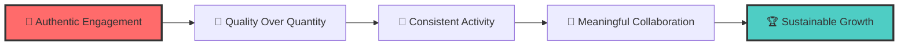

</div>

### ✨ The Golden Rules

| 🎯 **Principle** | 📝 **Implementation** | 🎉 **Result** |
|:-----------------|:-----------------------|:---------------|
| 🤝 **Authentic Engagement** | Genuine contributions to projects you care about | 🌟 Meaningful community connections |
| 💎 **Quality Focus** | Well-documented, useful repositories | ⭐ Higher star ratings and recognition |
| 🔄 **Consistency** | Regular activity over sporadic bursts | 📈 Steady rank improvements |
| 🤲 **Value Creation** | Solve real problems, help others | 👥 Natural follower growth |
| 📚 **Continuous Learning** | Document your journey and share knowledge | 🎓 Establish expertise and authority |

---

## 🎪 Advanced Profile Enhancement Tips

<div align="center">

### 🌈 Visual Storytelling Elements

</div>

<details>
<summary>🎨 <strong>Dynamic Visual Components</strong></summary>

#### **Animated Headers**
```markdown

```

#### **Typing Animation**
```markdown
[](https://git.io/typing-svg)
```

#### **Activity Snake Animation**
```markdown

```

#### **Visitor Counter**
```markdown

```

</details>

---

<div align="center">

### 🏅 Achievement Showcase Combinations

</div>

<div align="center">

| 🎯 **Profile Level** | 📊 **Stats Setup** | 🏆 **Trophy Config** | 🎨 **Visual Theme** |
|:---------------------|:-------------------|:---------------------|:---------------------|
| 🌱 **Beginner** | Basic stats + language stats | All ranks visible | Light, welcoming themes |
| 📈 **Intermediate** | Stats + streak + activity | Filter B+ ranks | Modern, professional themes |
| 🏆 **Advanced** | Full stats suite + custom widgets | S+ ranks only | Dark, sophisticated themes |
| 👑 **Expert** | Custom dashboard + metrics | SSS/Secret trophies focus | Unique, branded themes |

</div>

---

## 🌟 Motivation and Mindset

<div align="center">

### 💪 Remember Your Why

</div>

These ranking systems are **tools for growth**, not just vanity metrics. They should inspire you to:

<div align="center">

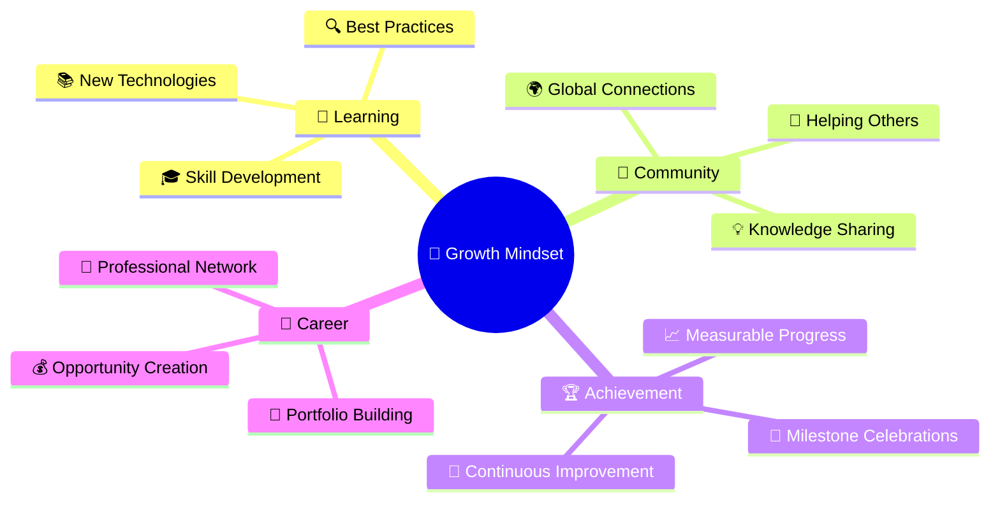

</div>

---

## 🎯 Action Plan: Your 30-60-90 Day Strategy

<div align="center">

### 📅 Structured Growth Plan

</div>

<div align="center">

| ⏰ **Timeline** | 🎯 **Focus Areas** | 📊 **Expected Outcomes** | ✅ **Action Items** |
|:----------------|:-------------------|:--------------------------|:--------------------|
| 🌱 **Days 1-30** | Profile Setup & Quick Wins | Basic trophies (C-B ranks) | • Set up both systems<br>• Create 5-10 repositories<br>• Make first contributions |
| 📈 **Days 31-60** | Content Creation & Community | Growing stats & A ranks | • Build quality projects<br>• Start contributing to OSS<br>• Engage with community |
| 🏆 **Days 61-90** | Optimization & Strategy | Higher ranks & recognition | • Refine profile aesthetics<br>• Focus on high-impact activities<br>• Build consistent habits |

</div>

---

## 🛠️ Tools and Resources

<div align="center">

### 🔧 Essential GitHub Profile Tools

</div>

<div align="center">

| 🛠️ **Tool** | 🎯 **Purpose** | 🔗 **Link** | ⭐ **Rating** |
|:------------|:---------------|:-------------|:--------------|
| 📊 **GitHub Readme Stats** | Dynamic statistics cards | `github-readme-stats.vercel.app` | ⭐⭐⭐⭐⭐ |
| 🏆 **GitHub Profile Trophy** | Achievement trophies | `github-profile-trophy.vercel.app` | ⭐⭐⭐⭐⭐ |
| 🎨 **Capsule Render** | Animated headers/footers | `capsule-render.vercel.app` | ⭐⭐⭐⭐ |
| ⌨️ **Typing SVG** | Animated typing text | `readme-typing-svg.herokuapp.com` | ⭐⭐⭐⭐ |
| 🐍 **Snake Game** | Contribution visualization | GitHub Actions workflow | ⭐⭐⭐⭐ |
| 👁️ **Profile Views Counter** | Visitor tracking | `komarev.com/ghpvc` | ⭐⭐⭐ |

</div>

---

## 🎉 Final Words of Inspiration

<div align="center">

> **"Your GitHub profile is your digital legacy. Make it count!"** 🌟

</div>

Remember that behind every impressive GitHub profile is a developer who decided to start, stay consistent, and share their journey with the world. Whether you're aiming for your first star ⭐ or your thousandth commit 💻, every contribution matters.

The beauty of these ranking systems lies not in the competition, but in the **motivation they provide** to become a better developer and community member. Use them as stepping stones to:

- 🚀 **Push your boundaries** and try new technologies
- 🤝 **Connect with like-minded developers** worldwide  
- 📚 **Document your learning journey** for others to follow
- 💡 **Solve real problems** that matter to you and others
- 🌟 **Inspire the next generation** of developers

---

<div align="center">

### 🚀 Ready to Transform Your GitHub Profile?

**Start implementing these strategies today and watch your GitHub presence evolve from ordinary to extraordinary!**

[](https://github.com)
[](https://github.com)
[](https://github.com)

---

*Happy coding, and may your GitHub profile shine brighter than ever! ✨*


</div>
